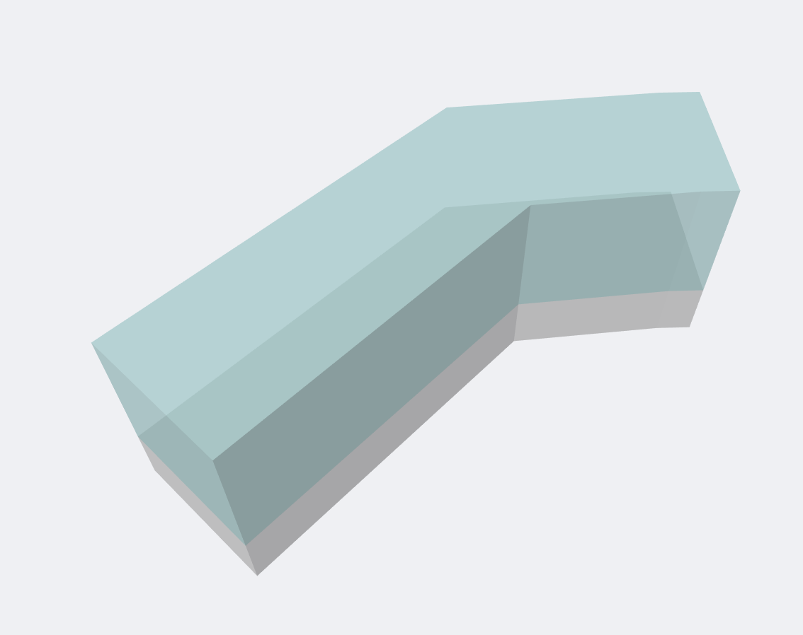

            
# Envelope By Spine

Creates building Envelope elements derived from a polyline spine sketch, width, and height.

|Input Name|Type|Description|
|---|---|---|
|Spine|Geometry|Spine of the building envelope.|
|Building Height|Range|Overall height of the building from grade.|
|Bar Width|Range|Width of the mass perpendicular to the spine.|
|Foundation Depth|Range|Depth of the building envelope below grade.|

 

|Output Name|Type|Description|
|---|---|---|
|Height|Number|Height of the building.|
|Subgrade|Number|Depth of the subgrade section.|

